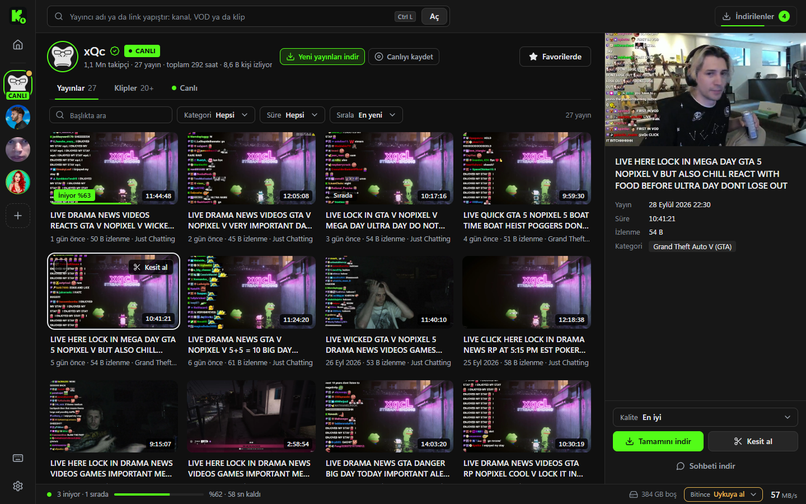
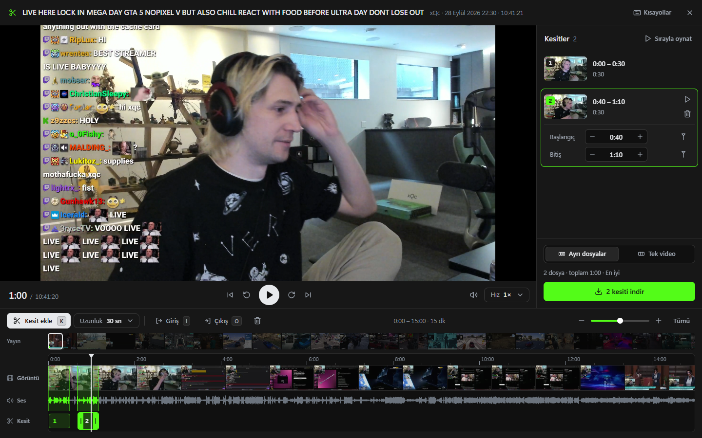
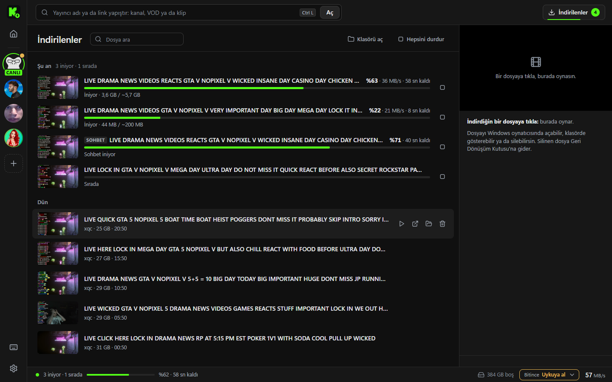
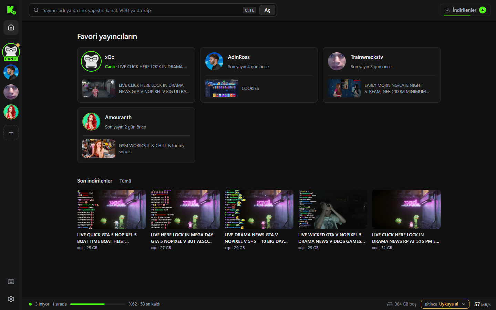
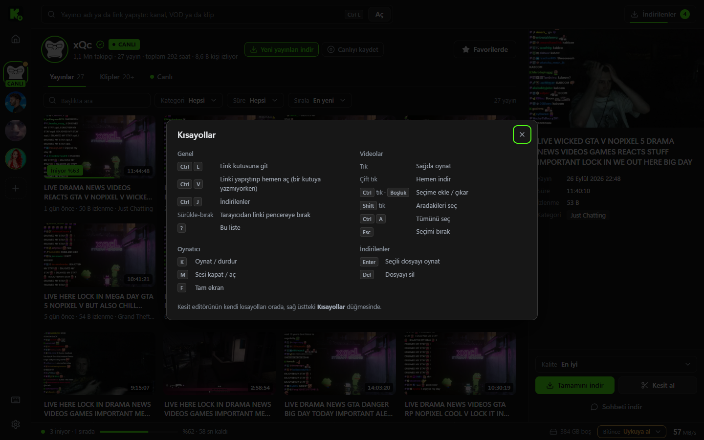

  

<h1 align="center">Kick İndirici</h1>

  Kick yayınlarını (VOD), kliplerini ve canlı yayınları bilgisayarına indiren Windows programı. 
  Bir yayıncı aç, videoyu seç, bağlantın ne kadar hızlıysa o hızla insin.

  <a href="https://github.com/Cabro57/kick-indirici/releases/latest"><b>⬇ Son sürümü indir</b></a>
  &nbsp;·&nbsp; Windows 10 / 11 &nbsp;·&nbsp; Türkçe

  

## Kurulum

1. [Releases](https://github.com/Cabro57/kick-indirici/releases/latest) sayfasından `KickIndirici-x.y.z-windows.zip` dosyasını indir.
2. Zip'i istediğin bir klasöre çıkar, örneğin `Belgeler\KickIndirici`.
3. `KickIndirici.exe` dosyasını aç.

Kurulum gerekmez. `ffmpeg.exe` zip'in içinde gelir ve `KickIndirici.exe` ile aynı klasörde durmalıdır. Kesit alma, kesitleri birleştirme ve canlı kayıt için gerekir.

Windows 11'de program doğrudan açılır. Windows 10'da Microsoft Edge WebView2 Runtime yoksa program açılışta indirme sayfasını önerir.

> Windows SmartScreen "tanınmayan uygulama" uyarısı verebilir. Program imzasız olduğu için bu uyarı normaldir. **Ek bilgi → Yine de çalıştır** ile açabilirsin.

## Neler yapabilir

### Yayıncını aç, istediğini indir

Üstteki kutuya yayıncının adını yaz ya da bir kanal, VOD veya klip linki yapıştır. Linki tarayıcıdan pencereye sürükleyebilir ya da herhangi bir yerde <kbd>Ctrl</kbd>+<kbd>V</kbd> ile yapıştırabilirsin. Panoda Kick linki varsa program açmayı kendisi önerir.

- Yayınlar, klipler ve canlı yayın ayrı sekmelerde listelenir. Başlığa, kategoriye ve süreye göre süzebilir, sıralayabilirsin.
- Bir karta tıklayınca video sağda oynar. Çift tıklayınca hemen iner.
- <kbd>Ctrl</kbd>+tık ile birden çok video seçip hepsini tek seferde indirebilirsin.
- Kalite: En iyi, 1080p60, 720p60, 480p, 360p ya da 160p.

### Hız ayarı gerektirmez

Her video parçalar halinde, birçok bağlantıyla aynı anda iner. Program toplam hızı ölçer ve aynı anda kaç video ineceğine kendisi karar verir. Ayar yapmadan hattın tamamı kullanılır.

İstersen hız sınırı koyabilirsin. Böylece oyun oynarken ya da yayın izlerken hat tamamen dolmaz.

### Kesit al

  

Uzun bir yayının tamamını indirmek zorunda değilsin. Kesit editöründe yayının kare şeridini ve ses dalgasını görürsün. İstediğin anları işaretlersin. Program yalnızca o aralıkları indirir. Kesitleri ayrı dosyalar olarak ya da arka arkaya eklenmiş tek bir video olarak alabilirsin.

- <kbd>K</kbd>: bulunduğun anın etrafına hazır uzunlukta bir kesit ekler.
- <kbd>I</kbd> / <kbd>O</kbd>: kesitin başlangıcını ve bitişini işaretler.
- Kenarları çizelgede sürükleyerek ya da saat yazarak düzeltebilirsin.

### İndirilenler

  

- Süren her indirmenin yüzdesi, hızı ve kalan süresi görünür. Altta durum çubuğunda toplam ilerleme ve diskteki boş alan durur.
- İndirmeyi durdurursan ya da programı kapatırsan sonra kaldığı yerden devam eder. Yarım kalan indirmeler program yeniden açıldığında geri gelir.
- Bir video diske sığmayacaksa indirme başlamadan seni uyarır. Diğer indirmeler etkilenmez.
- **Bitince** menüsü: sıradaki her şey inince bilgisayarı uykuya alabilir ya da kapatabilir. Kapatmadan önce 1 dakika beklenir, bu sürede iptal edebilirsin.
- Biten dosyalar gün gün listelenir. Program içinde oynatabilir, klasörde gösterebilir ya da Geri Dönüşüm Kutusu'na gönderebilirsin.

### Favori yayıncılar

  

Yıldıza basarak yayıncıyı soldaki şeride eklersin.

- Yayıncı canlıya geçince Windows bildirimi gelir.
- Son bakışından beri kaç yeni yayın geldiği görünür.
- **Yeni yayınları indir**: yayıncının yeni yayınları bitince kendiliğinden iner. Program kapalıyken gelenler de program açıldığında iner.
- **Canlıyı kaydet**: yayıncı canlıya geçince kayıt kendiliğinden başlar.

### Canlı kayıt ve sohbet

- **Canlı kayıt**: süren bir yayını o andan itibaren kaydeder. Durdurunca ya da yayın bitince mp4 olur.
- **Sohbeti indir**: bir yayının sohbetini videoyla aynı adla `.ass` altyazı ve `.json` olarak kaydeder. Videoyu VLC ya da MPC ile açınca sohbet ekranın köşesinde akar.

### Kısayollar

  

Tüm kısayolların listesi için <kbd>?</kbd> tuşuna bas.

## Ayarlar ve dosyalar

| Ne | Nerede |
|---|---|
| İndirilen videolar | `İndirilenler\Kick` (Ayarlar'dan değiştirilebilir) |
| Ayarlar, geçmiş, yarım kalan indirmeler | `%APPDATA%\KickIndirici` |
| Log (sorun bildirirken ekle) | `%APPDATA%\KickIndirici\log.txt` |

Dosya adı şablonu ayarlardan değişir: `{kanal}`, `{baslik}`, `{tarih}`, `{id}`.

## Güncellemeler

Yeni sürüm çıkınca program açılışta haber verir. Yeni zip'i indirip eski klasörün üzerine çıkarman yeterli. Ayarların ve geçmişin `%APPDATA%` içinde olduğu için kaybolmaz.

## Sık sorulanlar

**Pencere siyah ya da boş açılıyor.**
WebView2 Runtime eksik ya da bozuk olabilir. Program bunu fark edince indirme sayfasını önerir. Windows 10'da ekran kartı kaynaklı siyah ekran için program GPU'yu kendiliğinden kapatır.

**"ffmpeg bulunamadı" uyarısı alıyorum.**
`ffmpeg.exe` dosyası `KickIndirici.exe` ile aynı klasörde olmalı. Zip'i yeniden çıkar.

**Abonelere özel yayınlar iner mi?**
Hayır. Program Kick hesabına giriş yapmaz. Yalnızca herkese açık yayınları ve klipleri indirir.

## Lisans ve uyarılar

- Bu depo yalnızca programın hazır sürümlerini barındırır.
- `ffmpeg.exe` [FFmpeg](https://ffmpeg.org) projesine aittir ve GPLv3 lisanslıdır. Lisans metni ve kaynak kod bilgisi zip'teki `LICENSE-ffmpeg.txt` dosyasındadır.
- Kick İndirici'nin Kick ile resmi bir bağlantısı yoktur. İndirdiğin içeriğin haklarına ve yayıncıların isteklerine saygı göster.
