

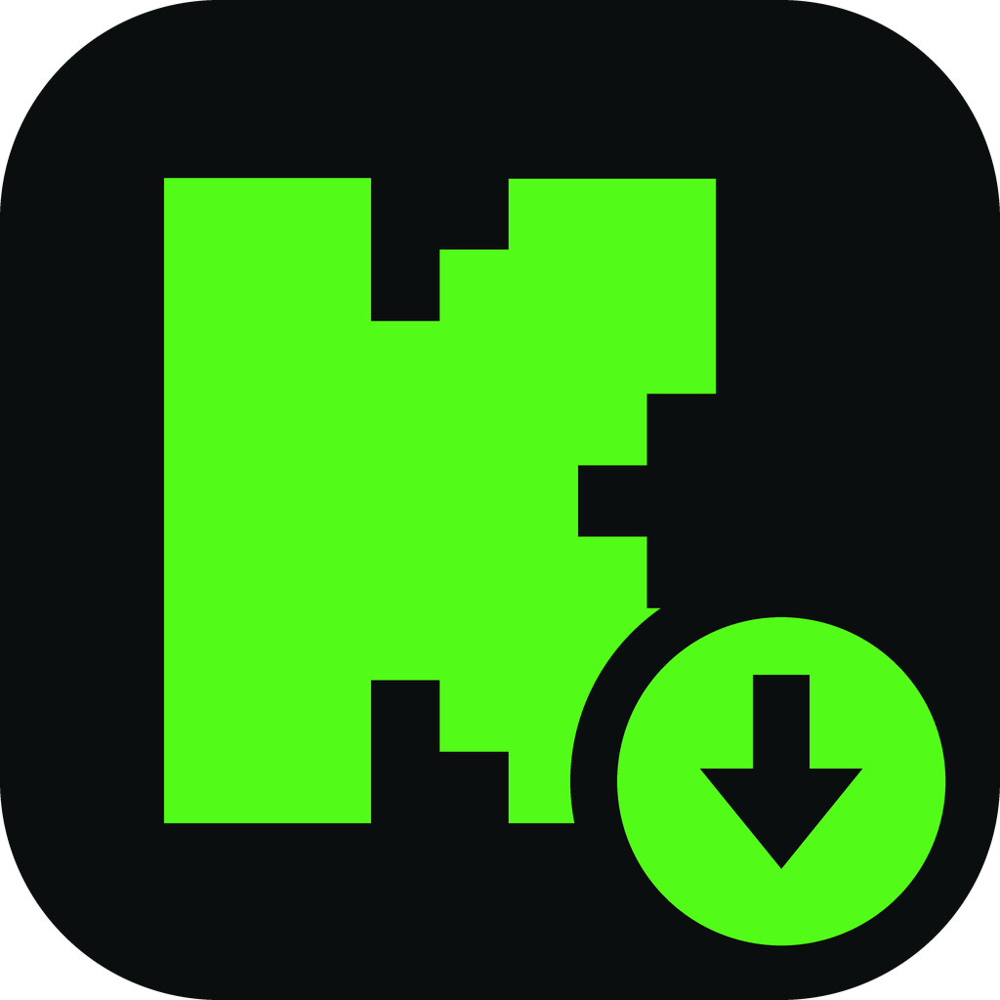

# Kick İndirici

**Kick yayınlarını, kliplerini ve canlı yayınlarını hattın izin verdiği hızla indir.**
İzle, içinden istediğin anı kes, canlıyı kaydet. Hepsi tek pencerede.

 

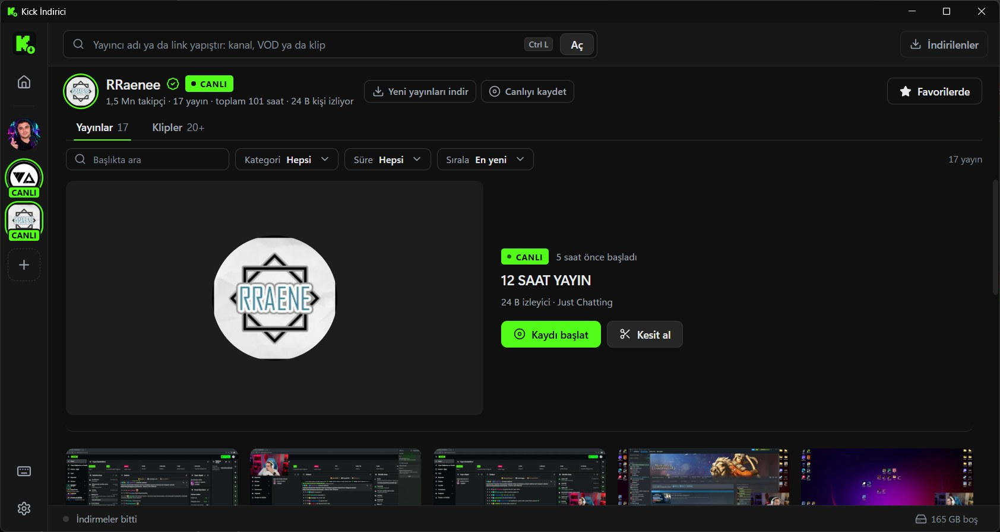

 

## İçindekiler

[Neler yapar](#neler-yapar) · [Kurulum](#kurulum) · [Nasıl kullanılır](#nasıl-kullanılır) · [Kısayollar](#kısayollar) · [Ayarlar ve dosyalar](#ayarlar-ve-dosyalar) · [Güncellemeler](#güncellemeler) · [Sorun giderme](#sorun-giderme) · [Lisans ve uyarılar](#lisans-ve-uyarılar)

 

## Neler yapar

### Yayıncıyı aç, hepsini bir bakışta gör

Üstteki kutuya kanal adını ya da bir **kanal / yayın / klip linkini** yapıştır. Yayınlar ve klipler küçük resimleriyle gelir. Kartın üzerine gelince önizleme sessizce oynar, kartı tıklayınca büyük pencerede açılır.

Yayıncı **canlıysa**, listenin en üstünde tam genişlikte bir **canlı şeridi** çıkar: canlı önizleme, başlık, izleyici sayısı ve iki düğme (**Kaydı başlat**, **Kesit al**).

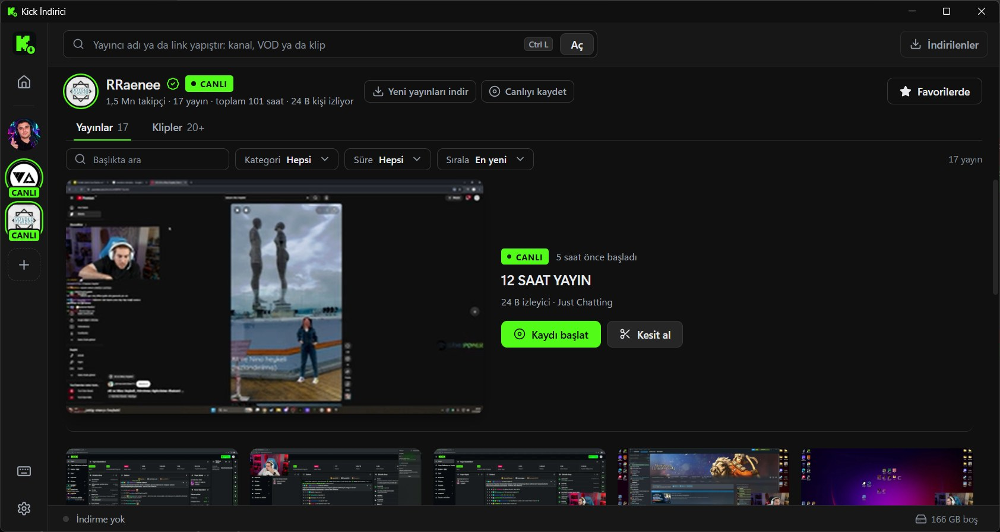

<table>
<tr>
<td width="50%" valign="top">

**Üzerine gelince önizleme**

Kartın üzerinde bekleyince video sessizce oynar. Tıkladığında izleme penceresi aynı andan devam eder.

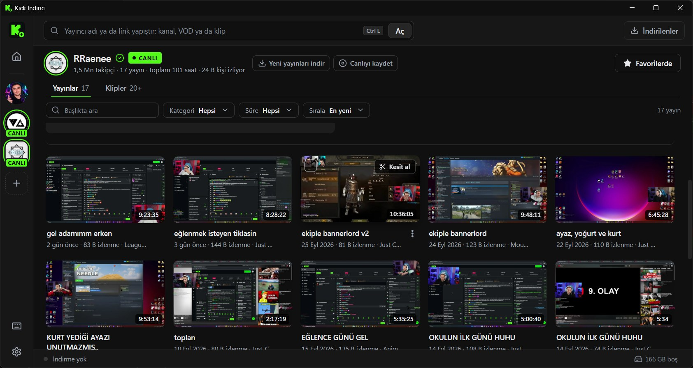

</td>
<td width="50%" valign="top">

**Favori yayıncılar**

Yıldıza basınca yayıncı soldaki şeride eklenir. Canlıya geçince yeşil halka yanar, yeni yayın gelince sayısı görünür. İstersen yeni yayınlar kendiliğinden iner, canlıya geçince kayıt kendiliğinden başlar.

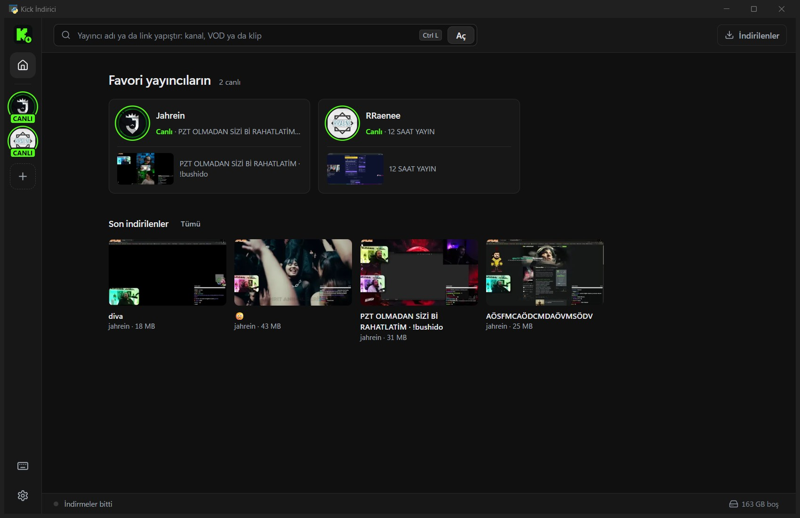

</td>
</tr>
</table>

 

### Ortada büyük pencerede izle

Bir videoya tıkla: karartılmış bir arka plan üstünde büyük bir pencere açılır. Sağ tarafta **kalite seçimi** ve işlemler durur: *Tamamını indir*, *Kesit al*, *Sohbeti indir*.

**← →** tuşları ya da kenarlardaki oklar bir önceki / sonraki videoya geçer. **Esc** kapatır ve videoyu durdurur.

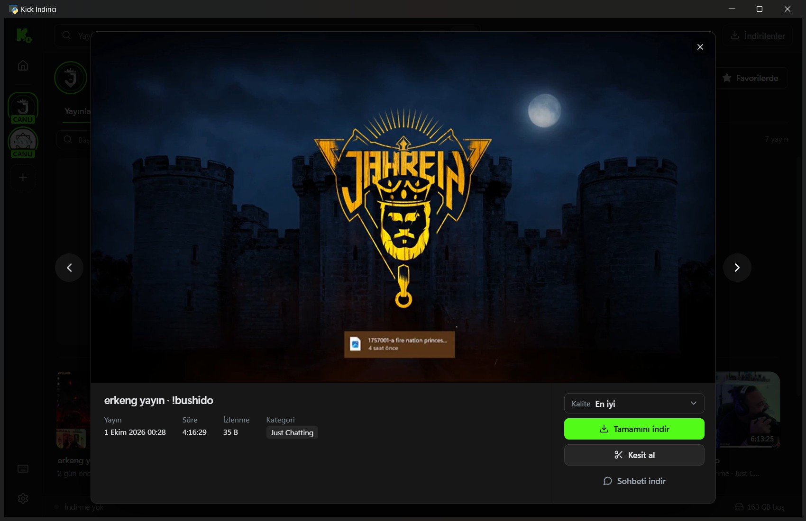

 

### Çok sayıda videoyu seç, tek tıkla indir

Kartın köşesindeki kutuya (ya da **Ctrl+tık**) basınca seçim başlar. Seçim varken düz tık seçime ekler / çıkarır; izlemek istersen kartın ortasındaki **▶** düğmesini kullan. **Shift+tık** aradakileri seçer.

Altta bir çubuk belirir: kaç video seçtiğin, **toplam süre**, kalite ve **İndir (n)**. Sayıya tıklarsan seçtiklerin listelenir, her birini tek tek çıkarabilirsin.

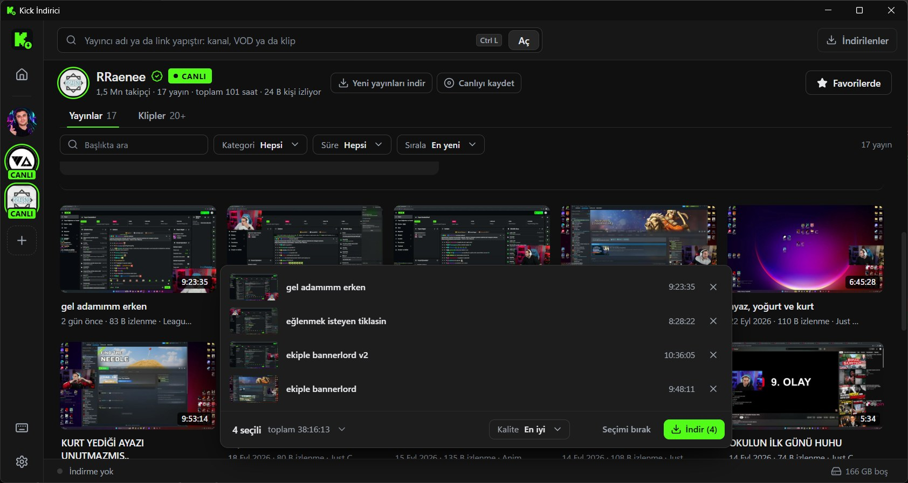

 

### Her kartta ⋮ menüsü

Başlığın yanındaki **⋮** düğmesi ya da **sağ tık**. Menü videonun durumuna göre değişir: henüz inmediyse *İndir*, iniyorsa *Durdur*, durmuşsa *Devam ettir*, inmişse *Oynat* ve *Klasörde göster*. Ayrıca *Kesit al*, *Sohbeti indir*, *Kick'te aç* ve *Linki kopyala*.

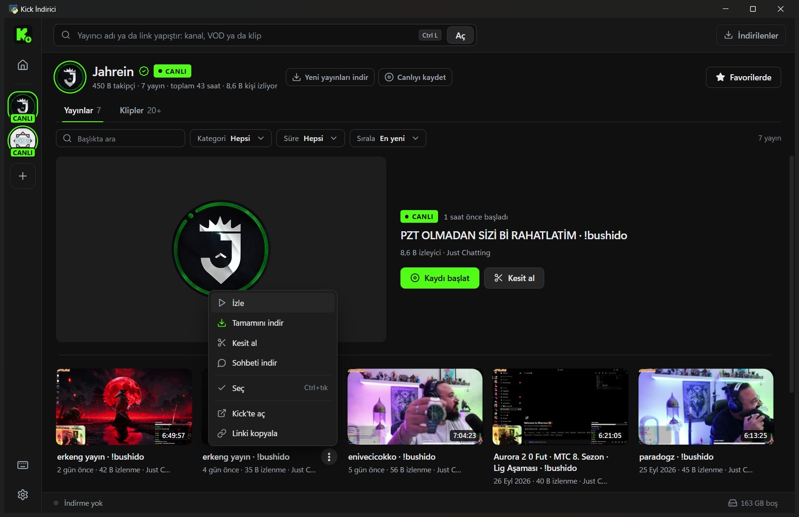

 

### Yayının içinden istediğin anı kes

**Kesit al** ile video editörü gibi bir pencere açılır: yakınlaştırılabilir zaman çizelgesi (kare şeridi ve ses dalgası), üzerine gelince kare önizleme, sürükleyerek gezinme, **0,25× – 4×** oynatma hızı.

- **K** ile playhead'in çevresine otomatik uzunlukta kesit eklenir. Kenarları sürükleyerek ya da saat yazarak ayarlarsın.
- Kesitler **ayrı dosyalar** ya da **tek video** olarak iner.
- Yalnızca o aralığı kapsayan parçalar indirilir. 4 saatlik yayından 30 saniyelik kesit için 4 saatlik veri çekilmez.
- Canlı yayından da kesit alabilirsin: yayın sürerken geçmişe dönüp istediğin anı kes.

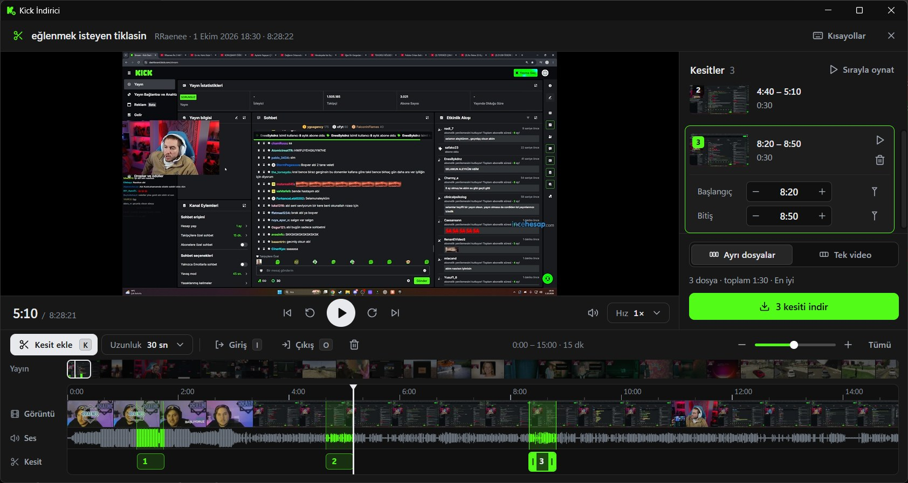

 

### İndirmeler: hızlı, okunaklı, kaldığı yerden devam eder

<table>
<tr>
<td width="50%" valign="top">

**Sırada ve inenler**

Kartlar üzerinde durum görünür (*İniyor %37*, *Sırada*, *İndirildi*). Alt çubuk toplam ilerlemeyi, kalan süreyi, hızı ve diskteki boş yeri gösterir.

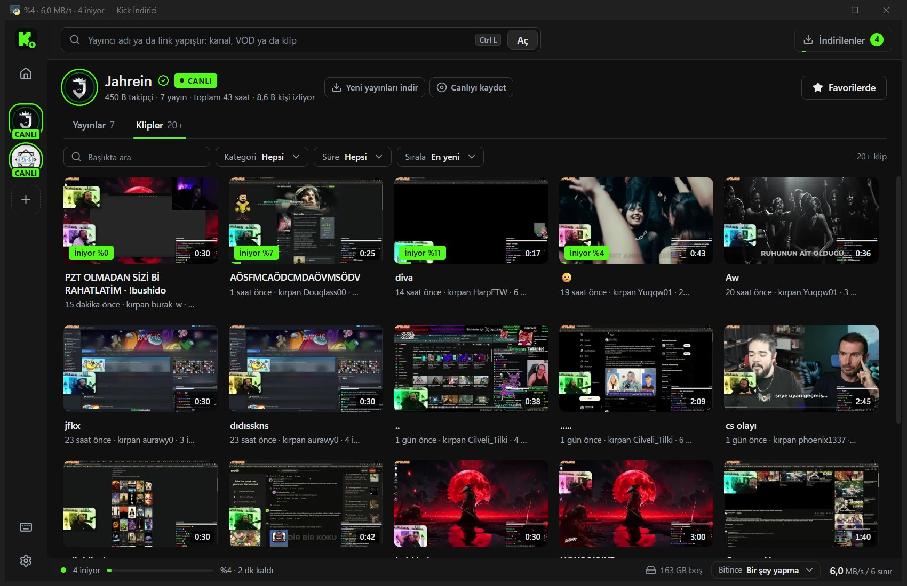

</td>
<td width="50%" valign="top">

**İndirilenler**

Bitenler güne göre gruplanır. Dosya uygulamanın içinde oynar, Windows oynatıcısında açılır, klasörde gösterilir ya da Geri Dönüşüm Kutusu'na gönderilir.

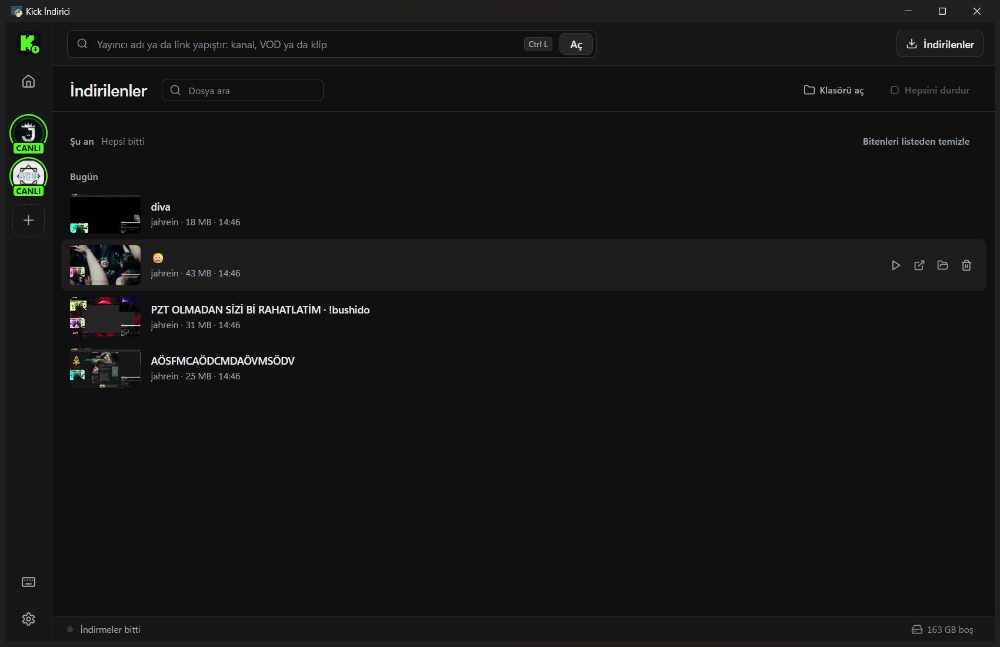

</td>
</tr>
</table>

### Daha neler var

| | |
|---|---|
| **Hız ayarı gerektirmez** | Aynı anda kaç video ineceğini (1–6) program, toplam hızı ölçerek kendisi ayarlar. Her video parçalarını 8–32 bağlantıyla çeker. |
| **Hız sınırı** | Oyun ya da yayın izlerken hattı doldurmasın diye toplam hıza üst sınır koyabilirsin. |
| **Canlı kayıt** | Canlı yayını şu andan itibaren kaydeder. Bitince `.ts` dosyası `.mp4`'e çevrilir. |
| **Sohbeti indir** | VOD'un sohbetini `.ass` altyazı (VLC / MPC videonun üstünde akıtır) ve `.chat.json` olarak kaydeder. |
| **Kaldığı yerden devam** | Program kapanırsa yarım kalanlar bir sonraki açılışta *Devam et* ile sürer. |
| **Disk koruması** | İndirmeden önce boş yer kontrol edilir. Sığmayan indirme açık bir mesajla başarısız olur, kuyruğun geri kalanı sürer. |
| **Bitince** | Kuyruk bitince hiçbir şey yapma, uykuya al ya da bilgisayarı kapat (60 sn geri sayım, iptal edilebilir). |
| **Pano ve sürükle-bırak** | Panoda Kick linki varsa pencereye dönünce önerir. Tarayıcıdan linki pencereye bırakabilir ya da Ctrl+V ile yapıştırabilirsin. |
| **Windows bildirimleri** | Kuyruk bitince ve favorin canlıya geçince bildirim. İkisi de ayarlardan kapatılır. |
| **Dosya adı şablonu** | `{kanal} - {baslik} [{id}]` gibi: `{kanal}` `{baslik}` `{tarih}` `{id}` kullanılabilir. |
| **Tek örnek** | Program zaten açıksa ikinci kez açmak mevcut pencereyi öne getirir. |
| **Güncelleme denetimi** | Açılışta GitHub'daki son sürümü denetler, yenisi varsa şeritte haber verir. |

 

## Kurulum

### Tek tıkla kurulum (önerilen)

1. [**Releases**](https://github.com/Cabro57/kick-indirici/releases/latest) sayfasından **`KickIndirici-Setup-….exe`** dosyasını indir.
2. Aç ve **Kur**'a bas. Yönetici izni gerekmez. Başlat menüsüne kısayol eklenir, `ffmpeg` içinde hazır gelir.

> Windows "bilgisayarını korudu" (SmartScreen) uyarısı gösterirse **Ek bilgi → Yine de çalıştır**'a bas. Program henüz imzasız olduğu için çıkar.

### Kurulumsuz (zip)

`KickIndirici-…-windows.zip` dosyasını bir klasöre çıkar ve **`KickIndirici.exe`**'yi aç. `ffmpeg.exe` exe'nin yanında durmalı.

> ffmpeg olmadan videolar iner ama kesit, canlı kayıt ve son mp4 düzeltmesi çalışmaz.

### Gereksinimler

| | |
|---|---|
| **İşletim sistemi** | Windows 10 ya da 11 |
| **WebView2 Runtime** | Windows 11'de hazır gelir. Yoksa program açılışta indirme sayfasını önerir. |
| **.NET Framework 4.6.2+** | Windows'ta hazır gelir. |
| **ffmpeg** | Kesit, canlı kayıt ve mp4 düzeltmesi için (kurucuda ve zip'te hazır) |

 

## Nasıl kullanılır

1. **Aç.** Üstteki kutuya `kick.com/xqc`, sadece `xqc`, bir yayın linki ya da bir klip linki yaz. Klip linki doğrudan indirmeye gider.
2. **Seç.** Yayınlar sekmesinde videoya tıkla ve izle, ya da kartların köşesindeki kutularla çoklu seç.
3. **İndir.** *Tamamını indir*, *Klibi indir* ya da *Kesit al*. Gerisini program halleder.
4. **Bul.** *İndirilenler* düğmesi (Ctrl+J) bitenleri gösterir. Dosyalar varsayılan olarak `Kullanıcı\İndirilenler\Kick` klasörüne gider.

> **İpucu:** Yayının neresinde ne olduğunu bakmak için kartın üzerinde bekle. Uzun yayınlarda önizleme baştan değil, yaklaşık %20'sinden başlar.

 

## Kısayollar

Listeyi uygulamada **?** tuşuyla da görebilirsin.

<table>
<tr>
<td valign="top" width="50%">

**Genel**

| Tuş | İş |
|---|---|
| `Ctrl` `L` | Link kutusuna git |
| `Ctrl` `V` | Linki yapıştırıp aç |
| `Ctrl` `J` | İndirilenler |
| `?` | Kısayol listesi |

**Videolar**

| Tuş | İş |
|---|---|
| Tık | İzle (seçim varken: seçime ekle / çıkar) |
| `Ctrl` tık · `Boşluk` | Seçime ekle / çıkar |
| `Shift` tık | Aradakileri seç |
| `Ctrl` `A` | Tümünü seç |
| `Esc` | Seçimi bırak |

</td>
<td valign="top" width="50%">

**Oynatıcı**

| Tuş | İş |
|---|---|
| `K` | Oynat / durdur |
| `M` | Sesi kapat / aç |
| `F` | Tam ekran |
| `←` `→` | Önceki / sonraki video |
| `Esc` | Kapat |

**Kesit editörü**

| Tuş | İş |
|---|---|
| `K` | Kesit ekle |
| `I` / `O` | Giriş / çıkış noktası |

Editördeki tüm kısayollar sağ üstteki **Kısayollar** düğmesinde.

</td>
</tr>
</table>

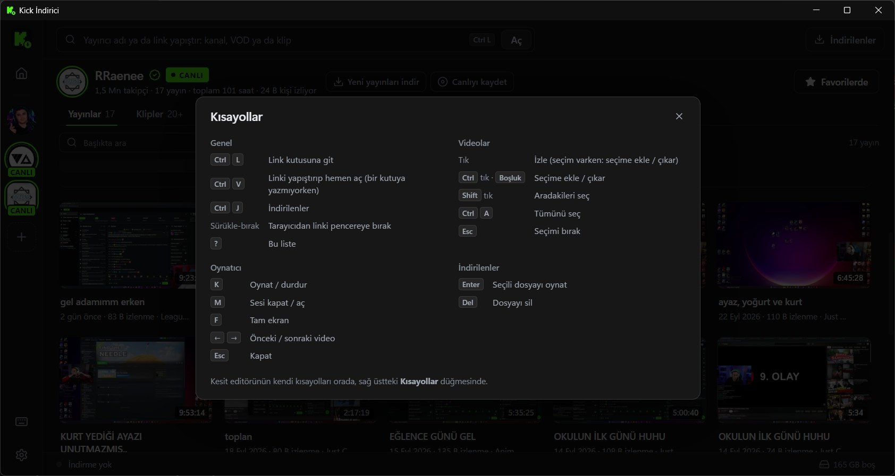

 

## Ayarlar ve dosyalar

<table>
<tr>
<td width="55%" valign="top">

Ayarlar sol alttaki dişli ile açılır: indirme klasörü, varsayılan kalite, dosya adı şablonu, aynı anda inen video sayısı, video başına bağlantı, hız sınırı, önizleme ve oynatıcı davranışı, bildirimler, varsayılan kesit uzunluğu ve güncelleme denetimi.

**Kalite:** En iyi · 1080p60 · 720p60 · 480p · 360p · 160p. İstenen kalite yoksa en yakın düşük kalite iner.

</td>
<td width="45%" valign="top">

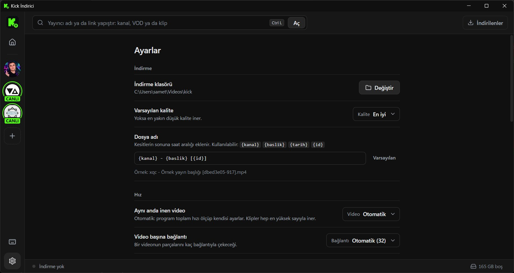

</td>
</tr>
</table>

Program verisini şurada tutar: `%APPDATA%\KickIndirici\`

| Dosya | İçerik |
|---|---|
| `settings.json` | Ayarlar ve favori yayıncılar |
| `history.json` | İndirilenler geçmişi |
| `queue.json` | Yarım kalan indirmeler |
| `log.txt` | Hata ayıklama günlüğü |

 

## Güncellemeler

Yeni sürüm çıkınca program açılışta haber verir (ayarlardan kapatılır). Kurucuyla kurduysan **Güncelle ve yeniden başlat**'a basman yeter: program yeni sürümü indirir, kurar ve kendiliğinden yeniden açar. Zip'ten çalıştırıyorsan yeni zip'i eski klasörün üzerine çıkar.

Ayarların ve geçmişin `%APPDATA%` içinde durduğu için güncellemede kaybolmaz.

 

## Sorun giderme

<b>Pencere siyah açılıyor</b>

 

WebView2 Runtime eksik ya da bozuk olabilir. Program açılışta bunu denetler ve indirme sayfasını önerir. "Zaten kurulu" diyorsa önce *Uygulamalar* bölümünden WebView2 Runtime'ı kaldırıp bağımsız kurucuyla yeniden kur.

Windows 10'da bazı ekran kartı sürücüleri WebView2'yi siyah çizer. Program bu durumda GPU'yu kendiliğinden kapatır; elle seçmek için `--gpu` / `--no-gpu` parametreleri var.

<b>"ffmpeg bulunamadı" uyarısı</b>

 

`ffmpeg.exe` dosyasını `KickIndirici.exe`'nin yanına koy ya da PATH'e ekle. Terminalde `ffmpeg -version` çalışıyorsa program da bulur.

<b>İndirme "403" ile başarısız oluyor</b>

 

Kick erişimi reddetti. Tekrar dene; sürerse video silinmiş ya da abonelere özel olabilir.

<b>Canlı kayıt <code>.ts</code> olarak kaldı</b>

 

Ayarlarda *Canlı kaydı mp4'e çevir* kapalıdır. Uygulamanın oynatıcısı `.ts` açamaz; Windows oynatıcısında aç ya da ayarı aç.

<b>Bir şey ters gidiyor</b>

 

`%APPDATA%\KickIndirici\log.txt` dosyasına bak. Kaynaktan çalıştırırken `python kick_indir.py --debug` geliştirici araçlarını açar.

 

 

## Lisans ve uyarılar

- Bu depo yalnızca programın hazır sürümlerini barındırır.
- `ffmpeg.exe` [FFmpeg](https://ffmpeg.org) projesine aittir ve GPLv3 lisanslıdır. Lisans metni ve kaynak kod bilgisi zip'teki `LICENSE-ffmpeg.txt` dosyasındadır.
- Kick İndirici'nin Kick ile resmi bir bağlantısı yoktur ve Kick tarafından onaylanmamıştır. Kişisel kullanım için yazılmıştır. İndirdiğin içeriklerin telif hakkı yayıncılara aittir; Kick'in kullanım koşullarına ve yayıncıların isteklerine saygı göster.
- *Kick* adı ve "K" simgesi Kick'e aittir.
